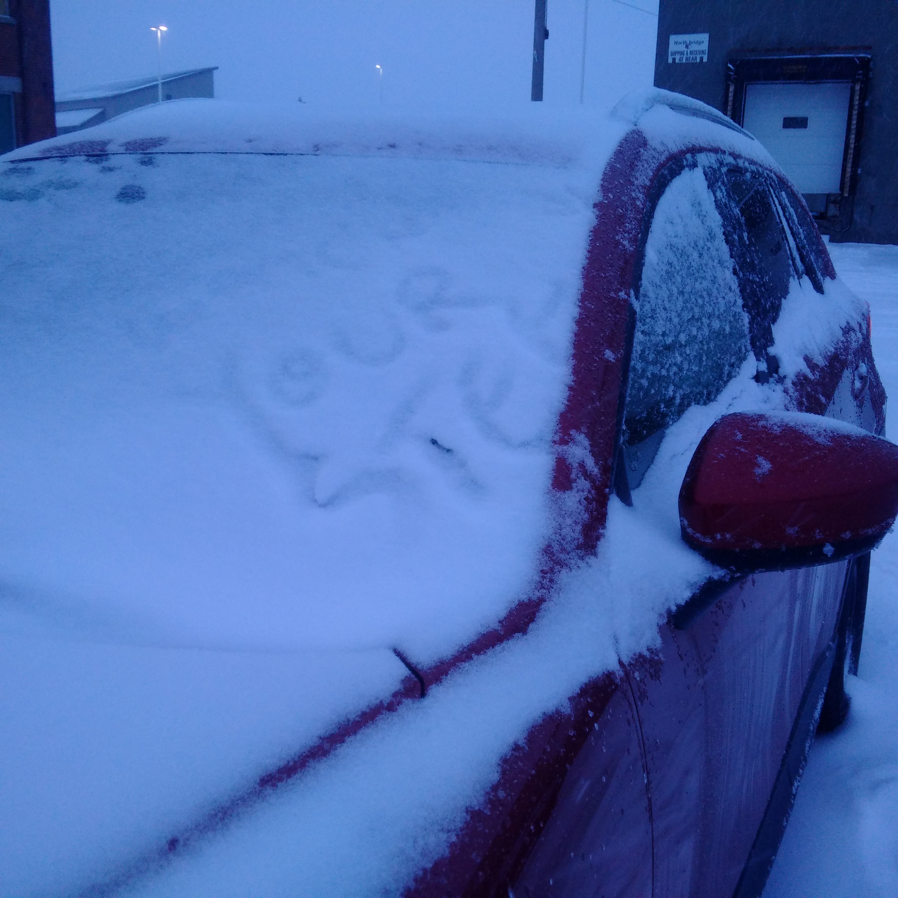

One night last week, I was leaving work. It was dark and rainy, and because the temperature was hovering around zero, it was also icy. I was waiting to cross the street to get to my parking lot.

The light changed. After checking that the intersection was clear, I started making my way across the street. It started raining harder, and the ground was slippery. I put up my hood and kept my gaze downwards, looking for icy patches.

Suddenly, despite looking at the ground, I noticed an increasingly bright light to my left. I looked up and was nearly blinded by a set of headlights just a few meters away. A car was making a left turn directly into my path, and was not slowing down.

The vehicle was close enough that I instinctually put my arms out in front of me in a "stop" gesture, as though that would help. At this point, the driver saw me and slammed on the brakes. Due to the ice on the road, the car continued to skid towards me. I managed to jump out of the way at the last moment.

This was a legitimately close call. But the moment I knew I was out of harm's way, this is the thought that popped into my head:

"That must have been really scary for the driver."

REALLY? I was almost just hit by a car while crossing the street at a green light. This was clearly an error on the part of the driver. What is wrong with me that my first thought is about how it must have been scary for THEM?

The thing is though, I have been that driver. When it's late, and it's dark, and it's raining, and I just spent 10 minutes in the cold scraping ice off my windows, and I'm trying to think about what we have in the house that I could make for dinner - it is not very hard to imagine accidentally missing the fact that a single person in a dark coat had started to cross the street.

I'm not a bad driver, and I'm not a bad person. But sometimes, I make mistakes, and so does everyone else. And if I had been that person, making that mistake, I would have been horrified and embarassed about coming so close to hitting a pedestrian who clearly had the right of way. Knowing that this kind of thing can easily happen to all of us, why would I bother getting upset?

Even if I'm wrong, and this driver was being reckless and irresponsible and didn't feel bad at all, there is still no reason why I should let them ruin my evening (or even the next 5 minutes) by getting upset about it. Here's a thing I read recently that sums up what I'm trying to say:

>"How you react is the only thing you can control. So, when bad stuff happens, you're in control. You determine the reaction which will determine how you feel. **Don't make yourself feel bad when you have the power to react positively and feel good.**" (from [Tim Denning's summary](https://medium.com/personal-growth/after-weeks-of-reading-tribe-of-mentors-heres-the-quick-lessons-you-can-learn-dde470325fe5) of the book "Tribe of Mentors")

This applies to so many things - things that happen at work, things that happen at home, things that happen in your town, things that happen across the world, things that you wish you'd done differently, things that you didn't have control over anyway. I choose to believe that the world is (for the most part) full of good people with good intentions, and it makes me a happier person because I don't feel personally attacked by the things that are happening around me.

On my way home after writing this post, someone left me a nice piece of evidence that I'm not crazy to believe this. An ice patch had formed next to my car, and they wrote "Watch your step" in the snow on my window :)

