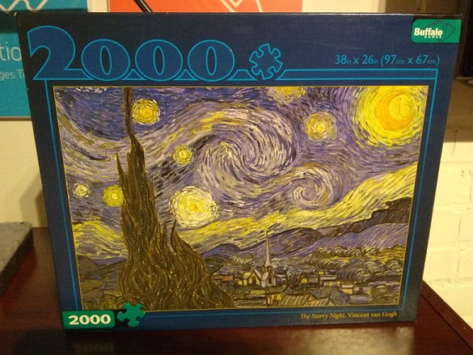
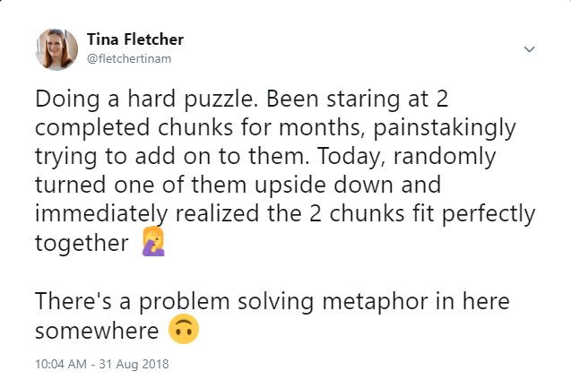
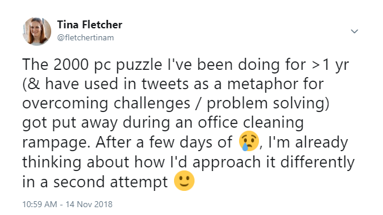

This is a puzzle that I worked on for over a year at my office.

There's usually some kind of communal puzzle going on in the kitchen near my desk, and typically each one is completed within a matter of weeks, but this one lasted for a particularly long time. There are a few reasons for this:

+ It's hard! Van Gogh's painting style makes it hard to see exactly what might match, and the puzzle manufacturer also used some very tricky piece shapes.
There are a lot of pieces! It's tough to find a table that's big enough to spread the all pieces out onto, much less with extra space for starting to fit them together.
+ It wasn't all there! It was clear that there were some missing pieces (an employee donated the puzzle after cleaning out their basement), but it was impossible to tell how many. This made it easy to "give up" when looking for any particular piece.
+ Anyway, as the months went on, I found myself drawing interesting parallels between the puzzle and other challenges I was facing at work. Here are 5 anecdotes about my work on the puzzle - **which of these problem solving metaphors might also apply to something you're working on right now?**

\#1. After a setback, sometimes all you need is one small step forwards to re-start momentum.
---
One day, after we'd been working on the puzzle for many weeks, something happened to it. It was never clear exactly what occurred, but a large proportion of the progress that had been made was wiped out. After this, no one worked on it for a while. I think the general sense was, why bother? It just sat there in its messed up state. Eventually, although I knew I wouldn't be able to quickly put it back how it was, I at least cleaned up the pieces and laid them out in a way that could be more easily picked back up by others. When I came back a few days later, the previously completed sections were mostly restored.

\#2. Looking at a problem in a slightly different way can lead to a big leap forwards.
---
This tweet pretty much sums it up:

\#3. If you are having trouble solving a problem, re-organizing or creating conditions for others to solve it can also be valuable.
---
Some days, no matter how long I sat there I could not find any new matching pieces in the puzzle. It always felt very frustrating to walk away from the table not having put a single thing together. Eventually, I learned that if I was having one of these days, instead of walking away without any concrete accomplishments I could try to leave behind the conditions for someone else to succeed. In the context of the puzzle, this meant things like re-organizing a group of pieces, or moving some things out of the way in order to provide a clearer view of a particular section, etc. Often, if I left after doing something like this, I'd walk by a while later and notice that someone else had been able to make progress as a result of the conditions I'd created. This sort of reminded me of my role as a manager :)

\#4. Re-starting a project from scratch could actually be a fantastic opportunity.
---

Although I was super disappointed at first, and never would have chosen to have all my work scrapped, I soon started to feel excited about the prospect of being able to start the puzzle over again. I could learn from the mistakes and difficulties we'd had in the past, and set up us for a much more satisfying and successful experience. There was one big question on my mind, though...

\#5. Sometimes, you really are trying to solve an impossible problem.
---
...exactly how many of the pieces really were missing? Was it just a few really obvious ones, and we were using the "not all the pieces are here" excuse too frequently when searching for something? Or was it really the case that a significant chunk of the puzzle was missing, and it might not feel like a significant accomplishment even if we did somehow finish putting together all the pieces we had? I couldn't think of any way to figure this out other than brute force counting them. So one afternoon, that's what I did. It actually only took less than an hour (as with anything, I started out slowly and then improved my speed significantly after iterating on how I was doing it). There were 1883 pieces in the box. So, > 5% of the puzzle was missing. That's more than 1 in every 20 pieces.

What now?
---
I decided that 5% was too high of a threshold - finishing the puzzle would be too difficult, and not satisfying enough. I probably would have considered starting again if the missing pieces had been more like 1% of the total. The puzzle, or what we have of it, now sits nicely boxed up on a shelf. But it taunts me every time I walk by. I'm considering finding and purchasing a new copy of it. I'm still very curious about how much the missing pieces had impacted our ability to make faster and better progress...
