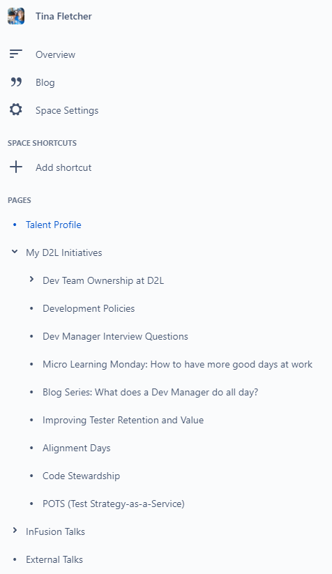

I think we can all agree that 2020 had more than its fair share of challenges and disappointments. So I thought I'd share one thing I did at work this year that I found to be really satisfying and rewarding. I created an internal resume for my time at D2L so far.

What's an internal resume?
---
It's similar to a "regular" resume, except it's much more detailed, and focuses on your experiences at a specific company. It can include things like teams and projects you've been on, initiatives you've been part of, and company or personal goals you're working towards.

At D2L, we're calling these internal resumes "Talent Profiles".

Why would I make one?
---
At D2L, we're starting to build Talent Profiles into our overall process for recommending and assessing people's readiness for promotions. But it's always been meant as a general career development tool. I also found the exercise of reflecting on my accomplishments throughout my time at D2L to be really rewarding. I love having a place I can go to review and celebrate what I've done already, and to get inspired about what I might try to do next.

What might it look like?
---
Here are some artifacts that will give you a sense of what my internal resume looks like. But yours might look completely different.

[PDF version of Tina's D2L talent profile](../images/Tina Fletcher - D2L Talent Profile - 2020.pdf)

Why did you write so many "alternate" resumes this year?
---
That's a great question, and one I've been asking myself as I write this post ;)

Over the summer, I did a career exploration exercise that resulted in a summary of my high level life and career goals. I then wondered if this overview could actually function as a very general resume. https://www.tinafletcher.ca/My-new-resume/

Then, as I reflected on the experience of reconnecting with someone I hadn't talked to in 23 years, I observed that summarizing 23 years of my life also felt a bit like writing a resume. https://www.tinafletcher.ca/Last-23-years/

Shortly afterwards, I made an internal transition to a new team at D2L, and as part of introducing myself to my new direct reports I decided to write a Readme which summarized my values and my approach to management. This, too, felt like I was writing a resume with a very specific target audience (i.e., my new team). https://www.tinafletcher.ca/Readme/

And now here I am, describing the experience of writing a company-specific internal resume. I guess 2020 has been a good opportunity to stop and take stock of things, while so many aspects of life have been on pause.

Having put lots of thought into where I'm at, I guess now it's time to do some planning for the future.
