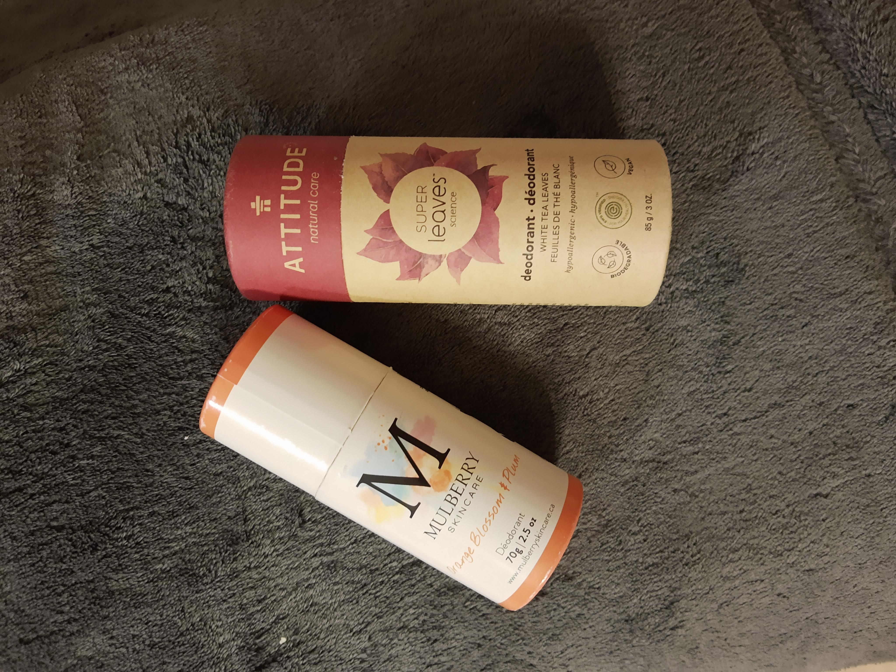

There are quite a few brands of deodorant that come in compostable packaging. Here are a couple that I've tried so far.

This thing is, so far every one I've found is *deodorant* - NOT anti-perspirant, which is what I've been using for decades. I mean, I guess deodorant is probably a healthier option, but personally I found this to be a bit of a tricky transition. Now that I'm fully switched over though, it's honestly been fine.

I will also note that the deodorants I've tried so far don't always agree with my skin (I occasionally notice some irritation). On the whole, they are pretty good at keeping bad smells away. I definitely don't mind using these from now on.
