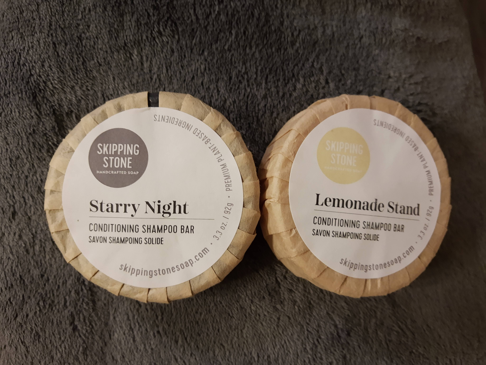
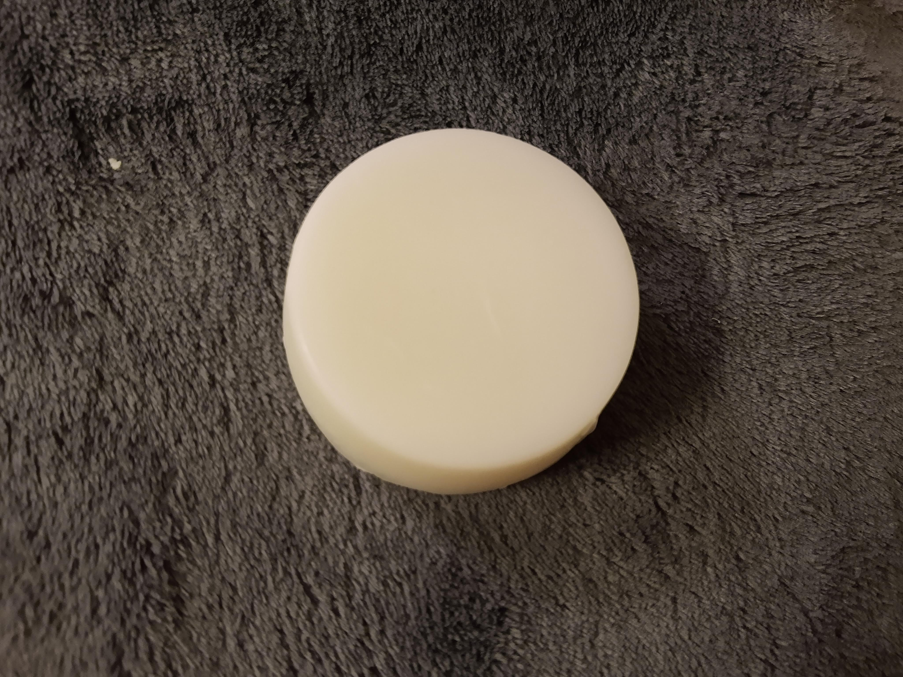
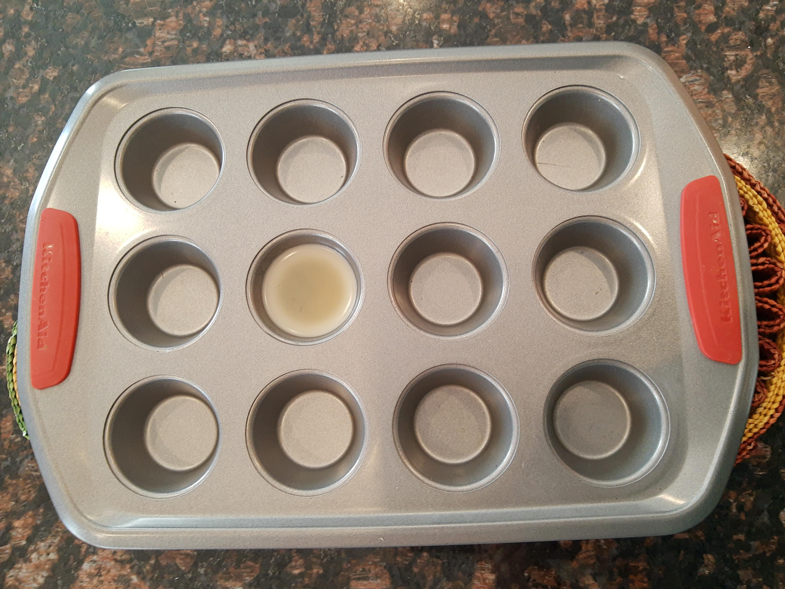

Shampoo and conditioner come in bar form, just like soaps! Just rub them directly on your hair. There are lots of brands out there. So far, I like Bottle None and Skipping Stone. I was very skeptical at first about how expensive they are compared to how small the bars are. However, they last a really long time (honestly) and I do think the cost is justifiable given how many uses they provide.

The results are pretty good overall - my hair might be a little less smooth these days, but not a huge difference. I do really like not having to try and squeeze the last bits of liquid shampoo and conditioner out of a bottle. When the bars start getting small and harder to use, I put the small pieces aside, and once I have a few of them I melt them into new "bars" using my toaster oven and a muffin tin. It works perfectly!

