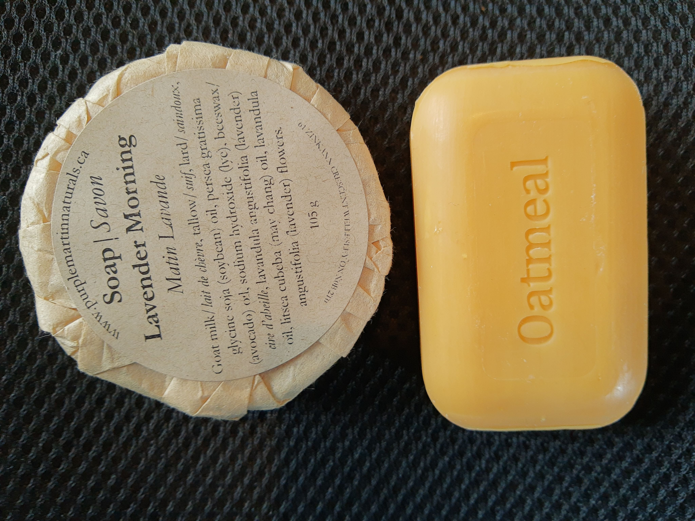

Finding a plastic-free replacement for body wash was a pretty easy one. Bar soap.

This is a place where you could go pretty cheap (think Irish Spring), or go fancier and try out something local and hand made (which will cost more, of course).

Just make sure to look for brands/formats that don't wrap the soap bars in plastic. I found quite a few brands that wrap individual soap bars in plastic, and then put them inside a cardboard box. The plastic wrapping is probably better than a plastic body wash container, as it's much thinner and smaller, but probably still best to avoid it if possible.

Bonus: check out [this post on mesh soap pouches](Shower-puff) for a mess-free method of storing your soap.

There are so many soaps out there... these are just a couple that I've tried so far ([The Soap Works](https://puresoapworks.com/) and [Purple Martin Naturals](https://www.purplemartinnaturals.ca/).)
