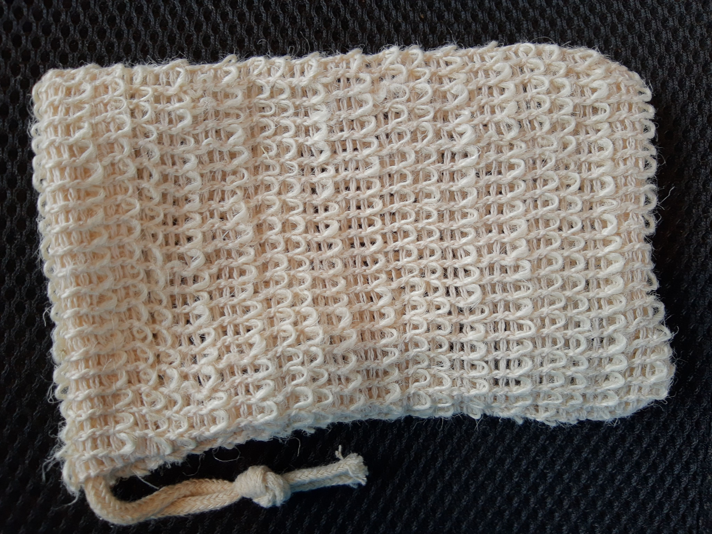

I was hesitant to give up the shower puffs that I've been using for decades now... they're great for exfoliation and for working up a nice lather. But I know they're made of nylon/plastic, so when I made the switch to bar soap I wanted to find an alternative for them too.

Mesh soap pouches made of natural fibers, such as the ones shown below, are amazing. In my experience they are even better at exfoliating, and still good at lathering. They're not expensive (I got a big stack of them for less than $20, and they are not wearing out quickly at all). I also like that the exact right amount of soap is used every time; I always felt that I spent a lot of time rinsing out the shower puff when excess bubbles were left in it at the end. There's also no hassle similar to trying to squeeze the last few drops of body wash out of the plastic container; when the piece of soap starts getting small, just add a new one in to the pouch and leave the old one where it is (it will get used up eventually).

(I ordered this from [Trounistro](https://www.amazon.ca/Trounistro-Exfoliating-Natural-Drawstring-Shower/dp/B07RTWPBRC/).)
