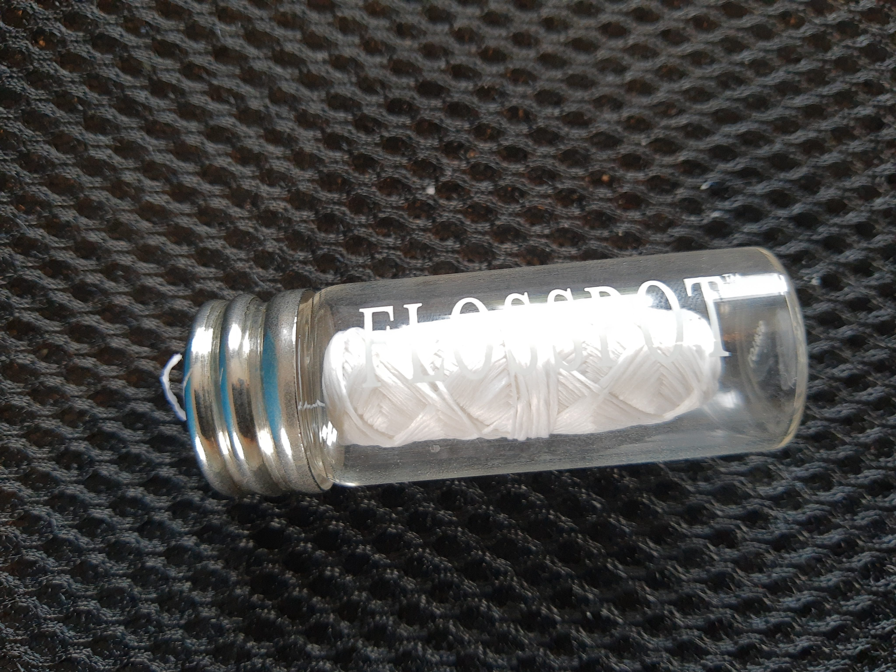

I now have a glass jar for dental floss, and the floss is refillable (i.e., just order a new roll once it runs out, but keep using the same glass jar).

Something I didn't know until recently is that strands of floss itself are made of nylon (which is a form of plastic). So it's not just the plastic packaging that's a problem.

The floss I'm using now is apparently corn-based. It feels quite a bit different than other brands I've used in the past; like, it's not as smooth (apparently it's only "lightly waxed", and I guess the nylon strands are more slippery in general). Overall I'd have to say that the experience is maybe slightly more comfortable with traditional floss, but to me it's not a significant drawback. I'm quite happy to continue using this new system.

(The company that makes this floss is [KMH Touches](https://kmhtouches.com/flosspot.html).)
