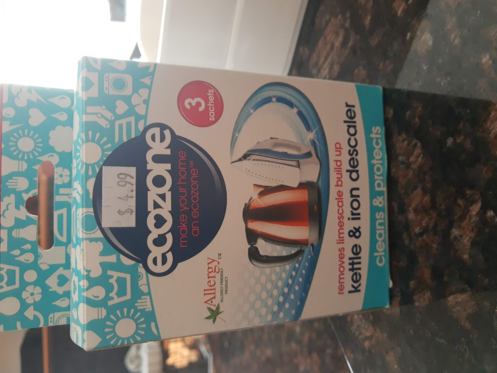

I used to use bottles of products like CLR to clean scale from appliances like kettles, humidifiers, etc. But I recently discovered that you can get citric acid in a foil pouch, which works amazingly well for the same purpose.

Even better, I've also discovered that some places sell citric acid in bulk and send it to you in a paper bag (e.g. [Bare Market](https://www.baremarket.ca)).
