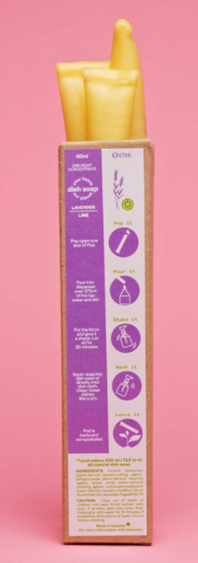

I have fully switched over the ETEE's dish soap pods. You can find them in Canadian dollars at [ETEE's Etsy shop](https://www.etsy.com/ca/shop/ETEEShop). A concentrate comes in compostable "pods", and you mix the contents with water. The dish soap works and smells great. This photo is from their web site.

