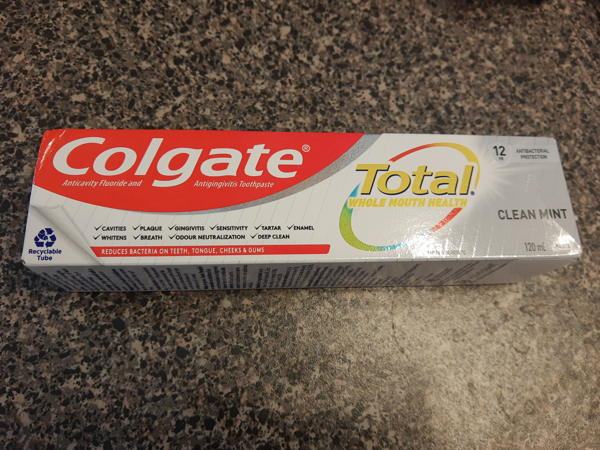

I haven't yet found my forever solution for plastic-free toothpaste. I tried chewable tablets, but definitely did not enjoy the brands that I've bought so far. I tried toothpaste that came in a re-usable, re-fillable glass jar, but I somehow felt like it didn't properly clean my teeth. Colgate came out with a recyclable toothpaste tube, which I suppose is better than all the standard ones that definitely have to go straight in the garbage, so I'm using that in the meantime. I'm going to keep trying chewable tablets though; there are lots more brands and maybe one of them will be a winner.

