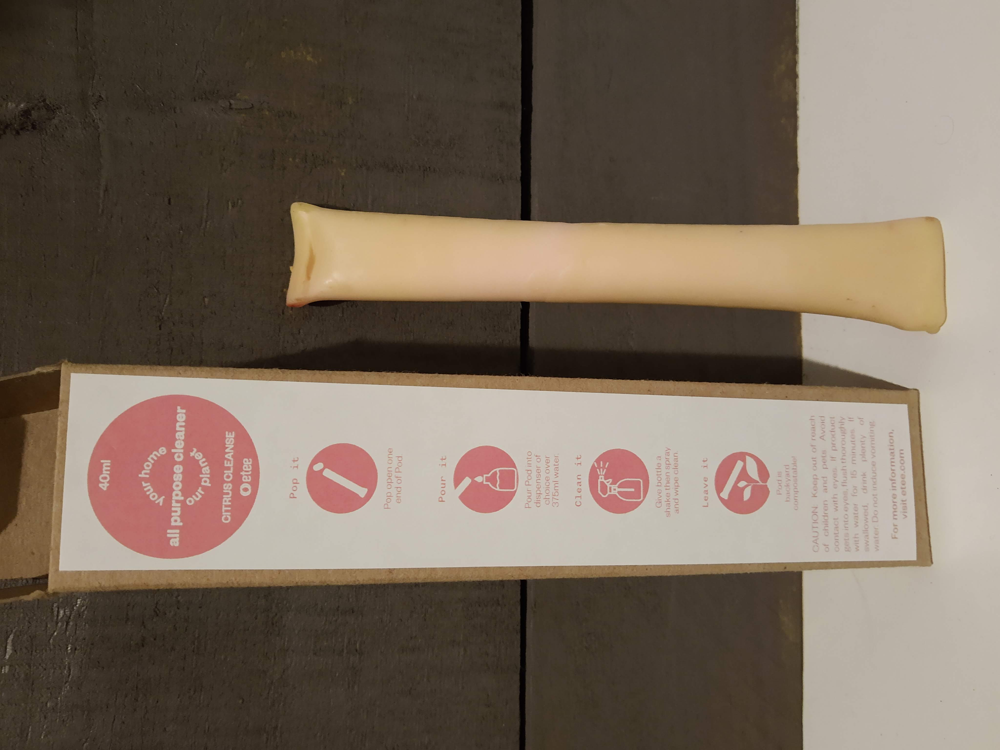
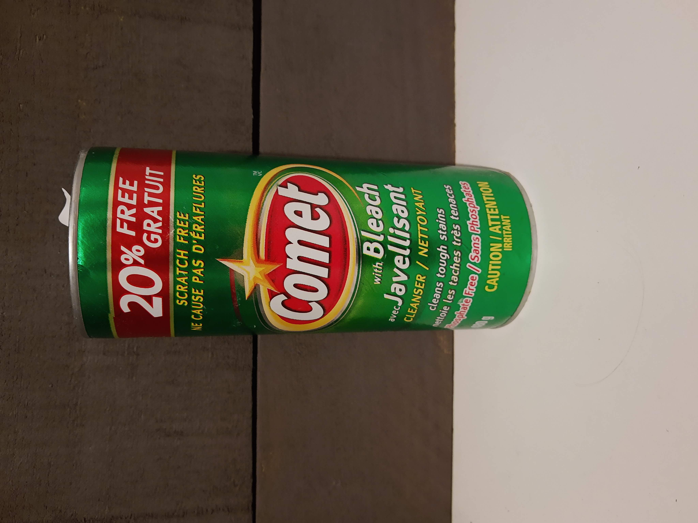

I wanted to like [ETEE](https://www.shopetee.com/)'s all-purpose cleaner. Similar to their [dish soap](https://www.tinafletcher.ca/Dish-soap/), it comes in a compostable pod containing a concentrate that you mix with water. The cleaner just doesn't work well. I find myself using a ton of it, and still feeling like it's not actually doing much to clean stuff. I won't buy this again.

I recently discovered an old container of Comet in the back of a cupboard somewhere. You know, the powder cleaner that's been around forever? I would guess that its ingredients might not qualify as entirely "environmentally friendly", but the packaging is just a cardboard tube with thin metal discs at the top and bottom. So I might actually use this until something better comes along - it certainly does clean effectively.

