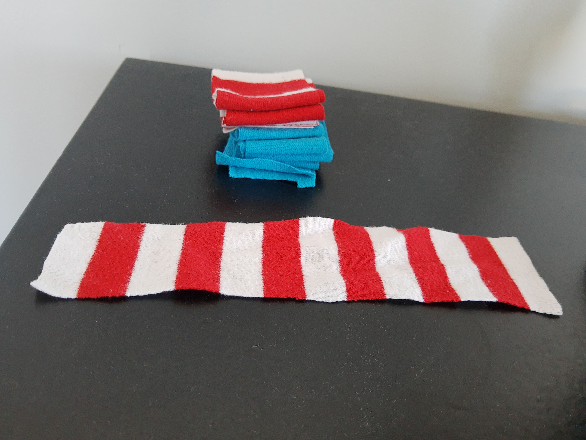

I guess cotton pads are biodegradable... but it's likely not the best idea to put them in the compost if you've used some kind of face cleaner product on them first. Also, they do tend to come in sleeve covered in a plastic wrapper.

Anyway, I recently started cutting up old cotton clothes into strips, folding them up, and using them as a cotton pad replacement. I toss the used strips into a mesh laundry bag (same kind that I wash bras in) and then put them in the washing machine. After washing, hang them to try, then fold them back up and repeat!

