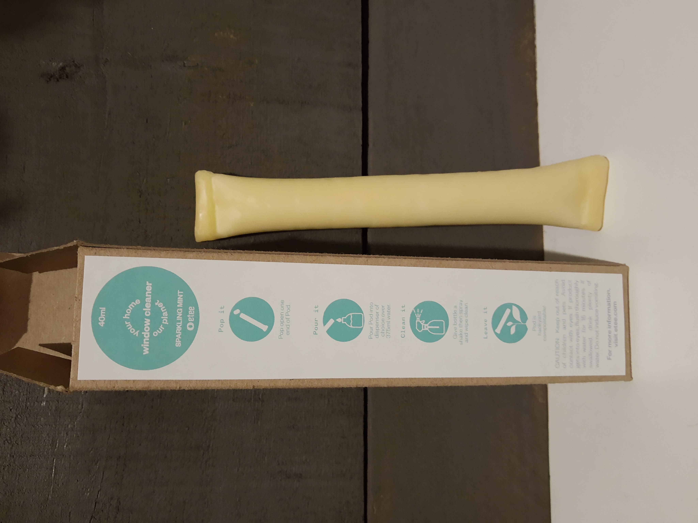

ETEE makes a glass cleaner, and similar to the [dish soap](https://www.tinafletcher.ca/Dish-soap/) and [all-purpose cleaner](https://www.tinafletcher.ca/All-purpose-cleaner/) it comes in a compostable pod containing a concentrate that you add water to. It works relatively well. It doesn't get things quite as immaculate as, say, Bon Ami glass cleaner... but I'm willing to make this particular switch in order to avoid buying more aerosol cans (or plastic bottles of Windex).

