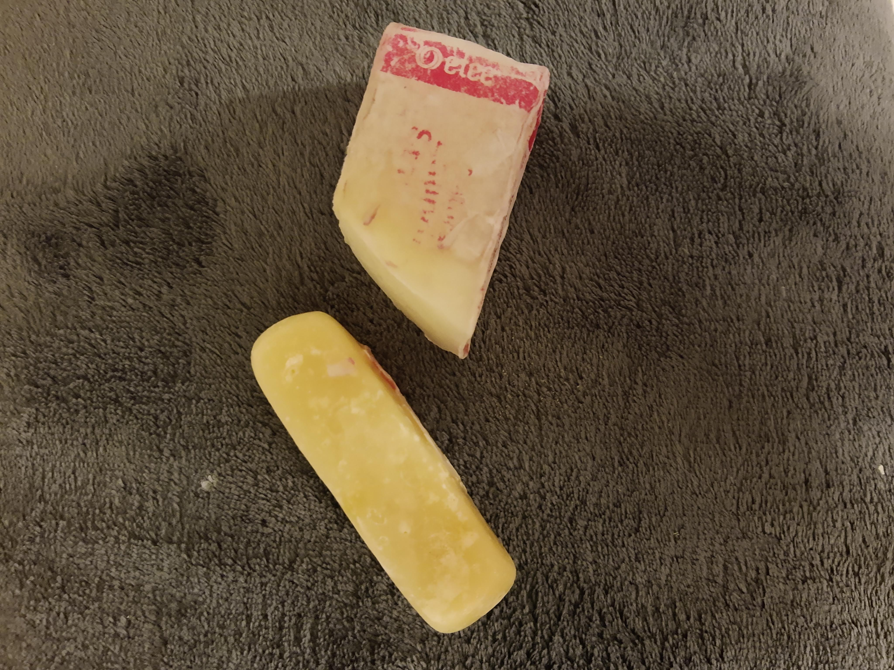

Instead of a liquid stain remover, there are lots of options for solid bars (similar to bar soap, I guess). They work pretty well. I'm sharing this picture of my gross looking, half used stain remover bars because they last so long that I have no idea when I'll actually end up buying new ones!

They are from [ETEE](https://www.shopetee.com/) and [Buncha Farmers](http://www.bunchafarmers.com/).

